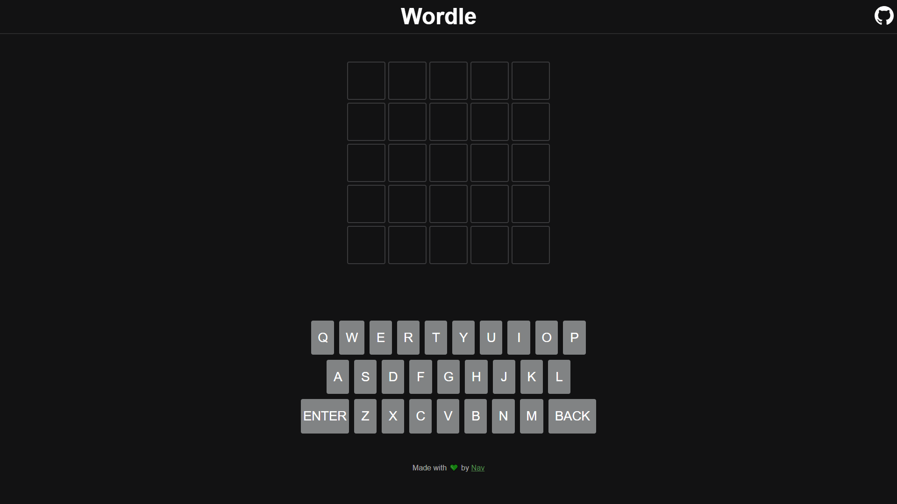
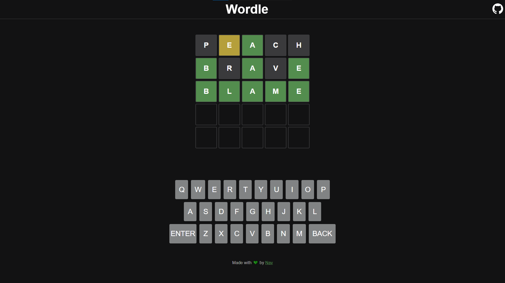
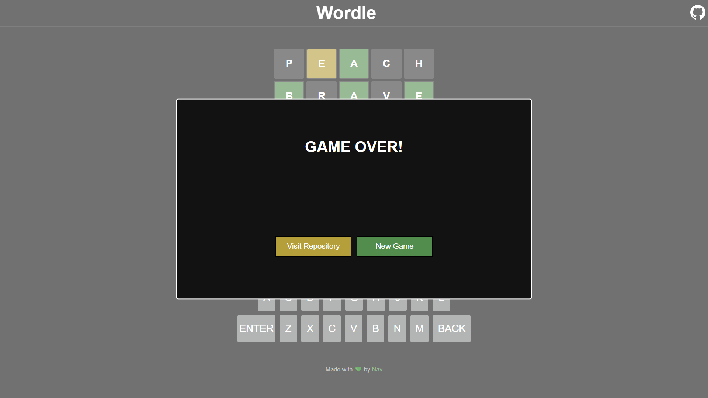

# Wordle 
My version of the popular game - wordle, built with React.js

<br />

## Screenshot



<i>NOTE: This app has a fully responsive layout</i>

<br />

## How to use
```bash
# Clone this repository
$ git clone https://github.com/ArnavGuptaaa/wordle

# Go into the repository
$ cd wordle

# Install dependencies
$ npm install

# Run the app 
$ npm start
```

<br />

## TODO
- Add keyboard support